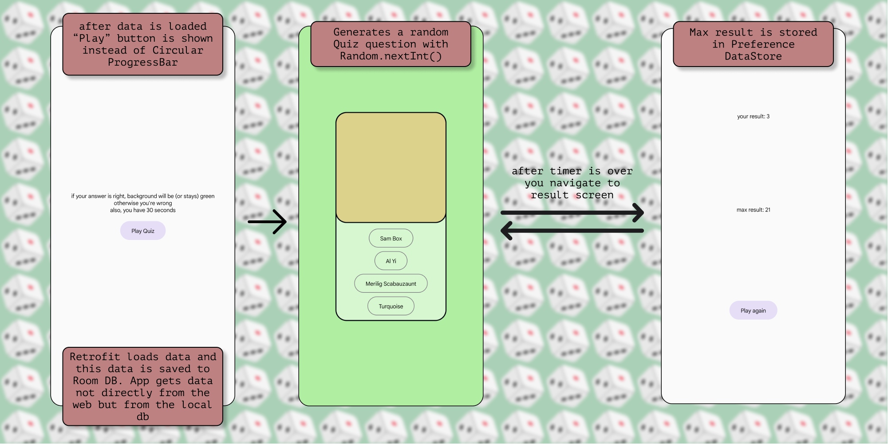

# Guess the Thing

This app loads data from https://uaserials.pro/cartoons/, the end result is a list of cartoons. App randomly picks one Cartoon from the list which is the right answer and randomly picks 3 names of other cartoons that != right answer. CountDown timer makes quiz limited by time (30 sec). After 30 seconds your result is saved to DataStore Preference.

## Screenshots


### What I used in this project:

- `Jetpack Compose` with [`Jetpack Navigation`](app/src/main/java/com/cherry/guessthething/presentation/MainNavHost.kt)
- [`Koin DI`](app/src/main/java/com/cherry/guessthething/di)
- `Coroutines`
- [`Ktor Client`](app/src/main/java/com/cherry/guessthething/data/remote)
- [`Room`](app/src/main/java/com/cherry/guessthething/data/local)
- [`DataStore Preferences`](app/src/main/java/com/cherry/guessthething/data/RepositoryImpl.kt#L23)
- `Coil`

### DataStore:

``` kotlin

    private val Context.dataStore: DataStore<Preferences> by preferencesDataStore(name = "quiz_result")
    private val MAX_RESULT_KEY = intPreferencesKey("max_result")
    
    suspend fun saveMaxResult(result: Int) {
        context.dataStore.edit { preferences ->
            val maxResult = preferences[MAX_RESULT_KEY] ?: 0
            if (result > maxResult) {
                preferences[MAX_RESULT_KEY] = result
            }
        }
    }

    fun getMaxResult(): Flow<Int> {
        val getResult = context.dataStore.data.map { preferenses ->
            preferenses[MAX_RESULT_KEY] ?: 0
        }
        return getResult
    }
    
```

### CountDown Timer:

``` kotlin

   suspend fun quizCountDown(time: Int, navAction: () -> Unit) {
    if (time > 0) {
        var funTime = time
        while (funTime != 0) {
            funTime--
            delay(1000)
        }
        navAction()
    }
}
```
